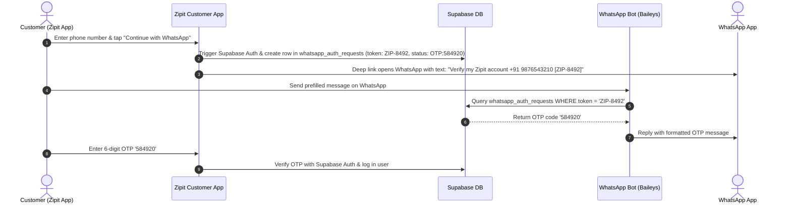

# 🤖 Zipit WhatsApp Verification & AI Customer Support Bot Specification

This document provides the complete, authoritative technical specification for building, deploying, and maintaining the **Zipit WhatsApp Bot**. Any AI coding assistant or software developer can consume this file to generate or update the entire bot codebase.

---

## 📐 1. System Architecture & Tech Stack

| Component | Technology | Description |
| :--- | :--- | :--- |
| **Runtime Environment** | Node.js (v18+ LTS, ES Modules) | High-concurrency backend service. |
| **WhatsApp Library** | `@whiskeysockets/baileys` | Multi-Device Web API without browser automation overhead. |
| **Database & Auth** | Supabase PostgreSQL (`@supabase/supabase-js`) | Real-time database for OTP requests, profiles, and live order tracking. |
| **Artificial Intelligence** | Google Gemini API (`gemini-2.0-flash` / `gemini-1.5-flash`) | Natural language understanding for customer support in Hinglish/Hindi/English. |
| **QR Code Engine** | `qrcode-terminal` | Terminal QR code rendering for multi-device pairing. |
| **Logging Engine** | `pino` | High-performance JSON logger. |

---

## 🗄️ 2. Supabase Database Schema Dependencies

### 2.1 Table: `whatsapp_auth_requests`
Stores verification challenges initiated by the Zipit Customer App.
```sql
CREATE TABLE whatsapp_auth_requests (
  id UUID PRIMARY KEY DEFAULT gen_random_uuid(),
  token TEXT UNIQUE NOT NULL, -- Format: ZIP-1234
  phone VARCHAR(20),
  status TEXT NOT NULL DEFAULT 'pending', -- 'pending' | 'OTP:123456' | 'verified'
  user_id UUID REFERENCES profiles(id),
  created_at TIMESTAMPTZ DEFAULT NOW(),
  expires_at TIMESTAMPTZ NOT NULL
);
```

### 2.2 Table: `profiles`
Stores user identity records.
```sql
CREATE TABLE profiles (
  id UUID PRIMARY KEY,
  name TEXT,
  phone VARCHAR(20) UNIQUE NOT NULL,
  photo TEXT DEFAULT 'NU',
  created_at TIMESTAMPTZ DEFAULT NOW()
);
```

### 2.3 Table: `orders`
Stores customer orders for real-time tracking lookup.
```sql
CREATE TABLE orders (
  id UUID PRIMARY KEY DEFAULT gen_random_uuid(),
  profile_id UUID REFERENCES profiles(id),
  status TEXT NOT NULL, -- 'Preparing' | 'Out for delivery' | 'Delivered' | 'Cancelled'
  total NUMERIC NOT NULL,
  items JSONB NOT NULL,
  delivery_address JSONB NOT NULL,
  created_at TIMESTAMPTZ DEFAULT NOW()
);
```

---

## ⚡ 3. Core Functional Workflows

### 3.1 Workflow 1: Reverse WhatsApp Supabase Auth OTP Verification



---

### 3.2 Workflow 2: AI Customer Support & Order Tracking Assistant

When an incoming message does **NOT** match `ZIP-XXXX`, route to AI Customer Support.

#### Step 1: Active Order Lookup
Query Supabase `orders` matching `delivery_address->>phone` or `profiles.phone = senderPhone`.

#### Step 2: Gemini AI Prompt Construction
```javascript
const systemPrompt = `You are Zipit Bot, the 24/7 AI Customer Support Agent for Zipit (10-Minute Rural Grocery Delivery App in India).
Customer Phone: +91 ${senderPhone}
Active Order: ${activeOrder ? `Order #${activeOrder.id.split('-')[0].toUpperCase()} - Status: ${activeOrder.status}, Total: ₹${activeOrder.total}` : 'No active order'}
Available Categories: Fruits, Vegetables, Dairy, Bakery, Snacks, Beverages, Household, Personal Care.

Customer Message: "${userText}"

Rules:
1. Respond warmly and concisely (2-4 sentences) in Hinglish / Hindi / English matching user tone.
2. Use WhatsApp formatting (*bold*, 📦, 🚚, ⚡ emojis).
3. If asking for order updates, use the exact Active Order details above.`;
```

---

## 🚀 4. Production Deployment Requirements

### Environment Variables (`.env`)
```env
SUPABASE_URL=https://bbaggauqnlcohrgvsios.supabase.co
SUPABASE_KEY=sb_publishable_rCjAUoKGrW0u-CCnBb9rQw_ori9Y1dQ
GEMINI_API_KEY=your_google_gemini_api_key_here
PORT=4000
```
